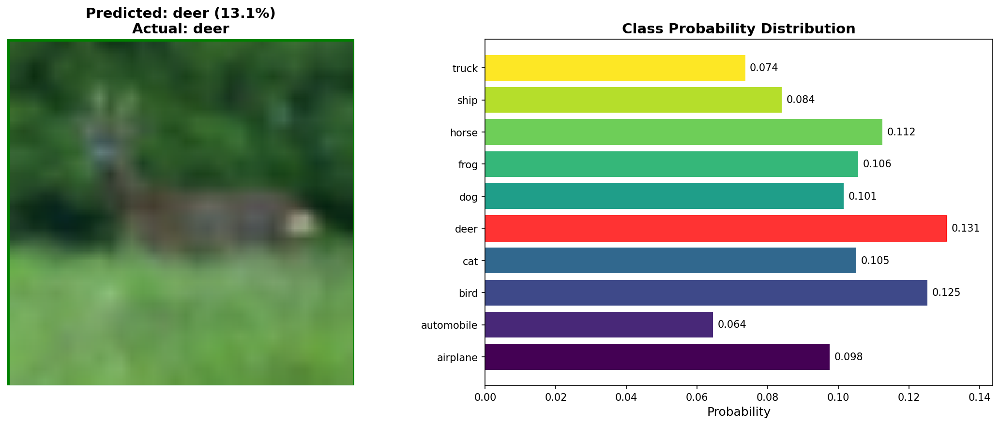
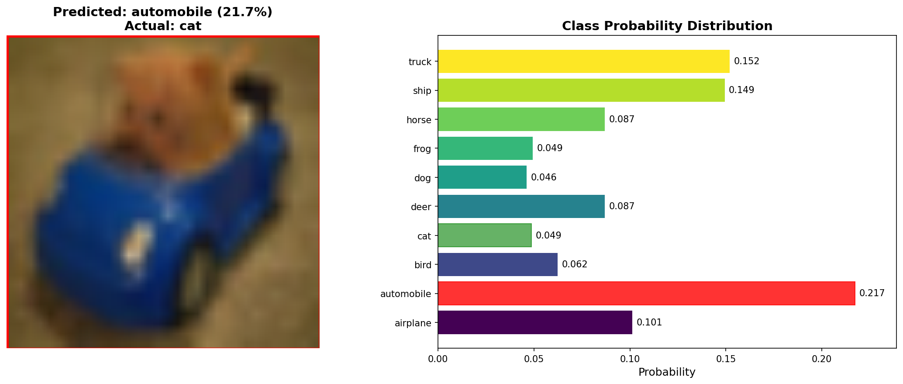

# CLIP-CIFAR: Contrastive Language-Image Pre-training on CIFAR-10

[](https://www.python.org/downloads/)
[](https://pytorch.org/)
[](https://opensource.org/licenses/MIT)

A PyTorch implementation of CLIP (Contrastive Language-Image Pre-training) model specifically designed for CIFAR-10 dataset. This project provides complete training, inference, and visualization capabilities for multimodal learning research and education.
<div align="center">
  
  
  
</div>

## 🎯 Quick Demo

```bash
# Run interactive demo with visualizations
python simple_inference.py --model_path ./simple_checkpoints/best_model.pth --demo
```

This will randomly select 5 CIFAR-10 test samples and display:
- 🖼️ Original images with prediction results
- 📊 Probability distribution charts for all classes
- 🎨 Color-coded accuracy indicators (green=correct, red=incorrect)
- 📁 Automatically saved visualization files

## 📦 Installation

### Prerequisites

- Python 3.8+
- CUDA (optional, for GPU acceleration)

### Install Dependencies

```bash
git clone https://github.com/your-username/CLIP-CIFAR.git
cd CLIP-CIFAR
pip install -r requirements.txt
```

### Dependencies

```
torch>=1.9.0
torchvision>=0.10.0
Pillow>=8.0.0
matplotlib>=3.3.0
numpy>=1.21.0
```

## 🚀 Quick Start

### 1. Train the Model

```bash
# Basic training with default parameters
python simple_train.py

# Custom training with specific parameters
python simple_train.py --epochs 5 --batch_size 128 --lr 0.001
```


### 2. Interactive Demo

```bash
# Run the full visualization demo
python simple_inference.py --model_path ./simple_checkpoints/best_model.pth --demo
```

### 3. Single Image Prediction

```bash
# Predict a specific image
python simple_inference.py --model_path ./simple_checkpoints/best_model.pth --image_path test_images/sample_0_cat.png
```

### 4. Text Encoding

```bash
# Encode text to vector representation
python simple_inference.py --model_path ./simple_checkpoints/best_model.pth --text "a photo of a cute cat"
```

## 🏗️ Project Structure

```
CLIP-CIFAR/
├── src/                           # Core source code
│   ├── models/
│   │   └── clip_model.py         # CLIP model implementation
│   ├── data/
│   │   └── dataset.py            # Dataset loading and preprocessing
│   └── utils/
│       └── metrics.py            # Evaluation metrics
├── simple_checkpoints/           # Model checkpoints
│   └── best_model.pth           # Best trained model
├── test_images/                 # Test images
├── data/                        # CIFAR-10 dataset
├── simple_train.py             # Training script
├── simple_inference.py         # Inference script with visualization
├── requirements.txt            # Project dependencies
└── README.md                   # Project documentation
```


## 🔧 Advanced Usage

### Command Line Arguments

#### Training Script (`simple_train.py`)
```bash
python simple_train.py [OPTIONS]

OPTIONS:
  --epochs INT        Number of training epochs (default: 3)
  --batch_size INT    Batch size (default: 64)
  --lr FLOAT          Learning rate (default: 0.0001)
  --embed_dim INT     Embedding dimension (default: 256)
  --device STR        Device selection (default: auto)
```

#### Inference Script (`simple_inference.py`)
```bash
python simple_inference.py --model_path PATH [OPTIONS]

OPTIONS:
  --demo              Run CIFAR demo mode
  --image_path PATH   Predict specific image
  --text STR          Encode specific text
  --device STR        Device selection (default: auto)
  --no_viz            Disable visualizations
```

### Batch Processing

```bash
# Server environment (no GUI)
python simple_inference.py --model_path ./simple_checkpoints/best_model.pth --demo --no_viz

# Batch process multiple images
for img in test_images/*.png; do
    python simple_inference.py --model_path ./simple_checkpoints/best_model.pth --image_path "$img" --no_viz
done
```

## 🔬 Technical Implementation

### Model Architecture

**Image Encoder:**
- Base: ResNet18
- Pre-training: ImageNet weights
- Output: 256-dimensional feature vectors

**Text Encoder:**
- Base: LSTM
- Vocabulary: Built from training data
- Output: 256-dimensional feature vectors

**Contrastive Learning:**
- Loss: Contrastive loss
- Temperature: 0.07
- Negative sampling: All other samples in batch

### Data Processing

**Image Preprocessing:**
```python
transforms.Compose([
    transforms.Resize((224, 224)),
    transforms.ToTensor(),
    transforms.Normalize(
        mean=[0.485, 0.456, 0.406],
        std=[0.229, 0.224, 0.225]
    )
])
```

**Text Preprocessing:**
- Lowercase conversion
- Basic tokenization
- Sequence length limit: 32 tokens
- Padding/truncation to fixed length


## 🙏 Acknowledgments

- [OpenAI CLIP](https://github.com/openai/CLIP) for the original inspiration
- [PyTorch](https://pytorch.org/) for the deep learning framework
- [CIFAR-10](https://www.cs.toronto.edu/~kriz/cifar.html) dataset
- The open-source community for various tools and libraries


**🎉 Start your multimodal learning journey! Run `python simple_inference.py --model_path ./simple_checkpoints/best_model.pth --demo` to experience the amazing visualizations!** 